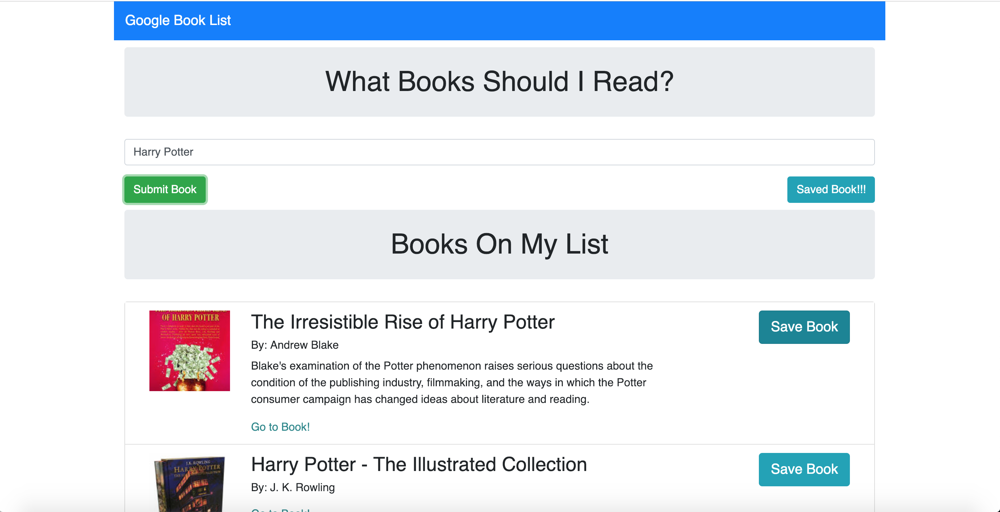

# NYTGoogleBooksSearch
Front End HTTP request using React Js & axios and Book Search Using Google API.

### Input any book and click Submit
Initially User will provide input as book name or any topic/author name.

Axios will fetch Google book API and React JS render all to front end. 
Front End side user can view Book Cover Page/Book Title/Book Author/Description and Link to page where user can buy book or see the price.
Anyone need this code!!! Just need Google Book API Key inorder to use this. Update in client/src/utils/API.js

Heroku Deploy @ https://rocky-dusk-47853.herokuapp.com/

